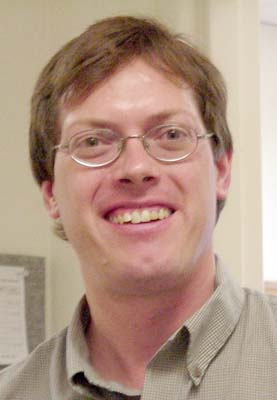

## The David Swenson Award

The David Swenson Award was created to recognize of scholarship, leadership, and service to the OCCC.

## Past Award Winners

* Andrew Scholer of Chemeketa Community College (April, 2025)
* Robert Surton of Chemeketa Community College (April 2023)
* John Blackwood of Umpqua Community College (April 2016)
* Dodi Coreson of Linn Benton Community College (May 2015)
* Sherry Yang & Jay Bockelman of Oregon Tech (May 2014)
* Ed Wright of Western Oregon University (October 2012)
* Mitch Fry of Chemeketa Community College (October 2011)
* David Todd of Mt. Hood Community College (October 2009)
* Peter Casey of Central Oregon Community College (April 2008)
* Linda Loft of Lane Community College (April 2007)
* Ron Wallace of Blue Mountain Community College (April 2006)
* David Swenson of Chemeketa Community College (Fall 2004)

## Award Criteria & Procedure

* Nominees can be suggested by any OCCC member. Nominee must have served as OCCC chair.
* An award committee consisting of available past award recipients and the current OCCC chair will
review nominees and select at most one per year. Preference should be toward a Community College
member over a 4-year University member.
* Recipients will be recognized at the next meeting of the OCCC and via
  [a letter]()
  sent to the president of their instution.

## David Swenson

David Swenson, the son of Ed and Judy Swenson, was born in Fullerton, California on March 22, 1965. He died on August 30, 2004 after having achieved the summit of Mt. Kilimanjaro in Africa. At the time, David was a dedicated instructor of Computer Science at Chemeketa Community College in Salem, Oregon. In 2002, David served as the chair of the OCCC.

David attended the University of Southern California from 1983 through 1987, earning of Bachelor of Science degree in Electrical Engineering. He then attended Rutgers from 1987 through 1990 where he earned a Masters of Science degree in Computer Science.

After completing his masters degree, David acquired a full time tenured faculty position at New Mexico State University (Carlsbad campus) where he taught Computer Science from 1990 through 1999. In the fall of 1999, he took a full time faculty position in the Computer Science department at Chemeketa Community College where he taught until his death in 2004.

David has been described by his colleagues as unfailingly friendly, supportive, polite, and self-effacing. His diverse interests included photography, supporting cultural understanding, protecting the environment, and collecting lighthouses. David was an avid outdoorsman and loved traveling the world, including a trip to China with his dad. He donated funds toward the creation of the Eco-Earth Ball at Riverfront Park in Salem; his name is listed there. He was very supportive of eclectic cultural events at Chemeketa and in the community, both as volunteer and audience member.

The first annual David Swenson Award was given to David and presented to his parents on October 15, 2004. 